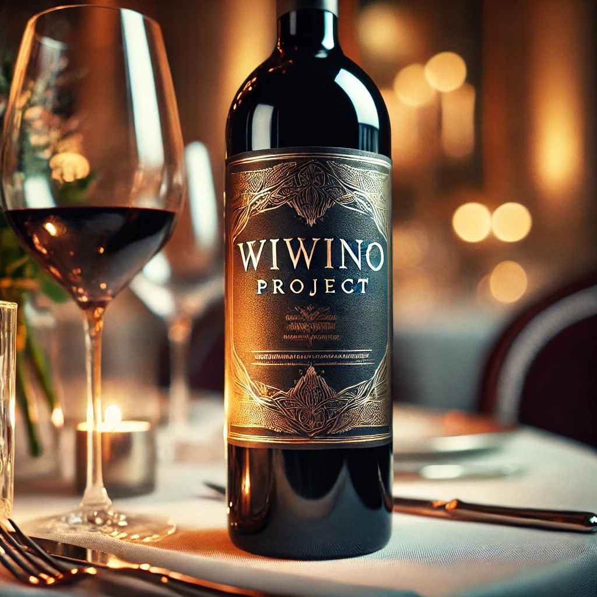

# 🍷 Wiwino project

## 📜 Description

This project focuses on conducting a comprehensive market analysis for Wiwino, a company operating in the wine industry. 
We will analyze the data collected over the years to gain insights into market trends, customer preferences, and other relevant metrics. 
The findings from this analysis will help Wiwino make informed decisions to boost sales, optimize marketing strategies, 
and improve overall business operations.

## 🗄 Libraries Used 

## 📦 Learning Objectives
 
•	Develop teamwork skills through the use of ticketing systems and Trello. [Click here](https://trello.com/b/4KkrZqmc/wiwino-project-step-1-db-queries-and-csv-output-files)

•	Enhance the ability to read and interpret SQL database diagrams.

•	Gain proficiency in querying a SQL database.

•	Learn how to write efficient SQL queries.

•	Create visual representations from aggregated insights derived from SQL queries.

•	Present a market analysis with clear numbers and visual aids.

## 🛠️ Data Structure

	/CSVs/ - This directory contains all the CSV files generated by SQL queries. 
	/Queries_py_sql/ - This directory houses all the SQL queries, written in Python or SQL. 
    /vivino.db - This file contains the main Vivino database.

## 📝 Goals

Wiwino aims to gain a better understanding of the wine market by analyzing data they have collected over the years. 
The analysis will focus on key areas such as identifying top wines, prioritizing countries for marketing, 
selecting award-winning wineries, and understanding customer preferences. The insights will be summarized 
and presented with the support of visual aids.

The market analysis must include answers to the following questions from the perspective of Wiwino:

	1.	Top 10 Wines: Identify 10 wines to highlight in order to increase sales and explain the selection.
	2.	Marketing Focus: Determine which country to prioritize for marketing based on a limited budget and justify the choice.
	3.	Award-Winning Wineries: Select 3 wineries to receive awards and explain the criteria for selection.
	4.	Customer Taste Cluster: Find wines related to specific keywords (coffee, toast, green apple, cream, citrus) and ensure that at least 10 users confirm these keywords. Provide an appropriate group name for this cluster.
	5.	Most Common Grapes: Identify the top 3 most common grapes worldwide and recommend the 5 best-rated wines for each grape.
	6.	Country Leaderboard: Create a visual showing the average wine rating for each country and vintage.
	7.	Cabernet Sauvignon Recommendations: Recommend the top 5 wines for a VIP client who likes Cabernet Sauvignon.
	8.	Additional Insights: Provide any other useful insights found in the data.
    9.      Visualize wine prices based on acidity, tannin, sweetness, and intensity.

## 👥 Contributors

Alisher Jardemaliyev 

Mathieu Lecouvet 

Rıdvan Gök

Christian Valéry Nguembou Tagne

## 📅 Timeline

- `Day 1`: Data Exploration

- `Day 2`: Query Development

- `Day 3`: Visualization Creation

- `Day 4`: Final Refinements

